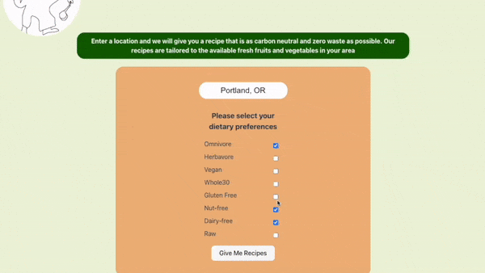

# Chef Du Chad

### By Emma Gerigscott and Sarah Reimann

## Description
A single page React app that uses the OpenAI API to create "local" recipes and zero-waste craft ideas. It also uses DALL-E to generate an image of the recipe.

## Technologies Used
* React
* TypeScript
* Vite
* OpenAI API
* CSS

## Media

#### React Component Diagram

## License
[MIT](./LICENSE.txt)
  

